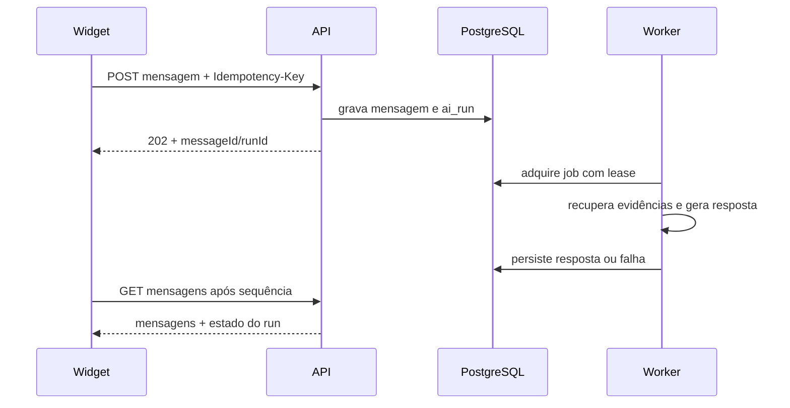

# Arquitetura do chat persistente

Status: vigente  
Última revisão: 17/09/2026  
Responsável técnico: equipe do Support Hub

## Sessão e conversa

O widget solicita uma sessão em `POST /api/widget/sessions` usando o ID da
instalação. A API associa a sessão à empresa e à instalação encontradas no
servidor. O token opaco é usado como Bearer somente pelo iframe; o loader e a
página hospedeira não recebem essa credencial.

Quando o armazenamento está disponível, o iframe mantém o token por instalação
e origem do pai. Caso contrário, usa memória e avisa que o histórico não poderá
ser retomado depois de recarregar.

## Envio e processamento

O transporte atual usa HTTP e consulta periódica. A primeira versão mostra a
resposta completa; streaming não faz parte do contrato vigente. Idempotency keys
protegem criação de conversa, envio e retry contra repetição acidental.

Jobs possuem lease e limite de tentativas. Se o navegador fechar, o worker pode
concluir o processamento. Ao reabrir, o widget recupera conversas e mensagens
pela sessão ainda válida.

Os tipos públicos estão em `packages/contracts/src/chat.ts`; consulte também a
[referência dos contratos](../reference/contratos-do-chat.md).
