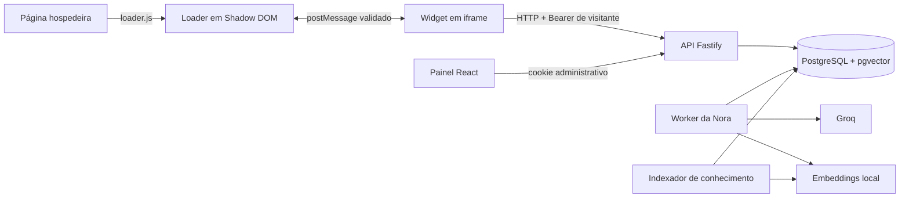

# Visão geral da arquitetura

Status: vigente  
Última revisão: 17/09/2026  
Responsável técnico: equipe do Support Hub

O Support Hub separa a integração pública, a interface incorporada, a API e o
processamento assíncrono. Essa divisão evita expor credenciais no navegador e
permite que uma resposta continue sendo processada depois que o widget fecha.

## Componentes

| Componente | Responsabilidade |
| --- | --- |
| `apps/loader` | Descobrir a instalação, criar botão/iframe e expor `window.SupportHub`. |
| `apps/widget` | Navegação, sessão do visitante, conversas e fontes dentro do iframe. |
| `apps/admin` | Login e edição/publicação da base de conhecimento. |
| `apps/api` | Configuração pública, autenticação, autorização, persistência e busca. |
| `apps/worker` | Consumir jobs e produzir respostas da Nora. |
| `npm run knowledge:index` | Consumir a fila de indexação de conhecimento. |
| `packages/contracts` | Tipos e schemas compartilhados. |
| `services/embeddings-local` | Gerar vetores com o perfil fixado do E5. |

## Fluxos principais

Na instalação, o host baixa o loader da origem do produto. O loader cria um
iframe para `/embed/:installationId`, negocia a conexão com `postMessage` e só
emite `ready` depois que canal e estilos estão prontos.

No chat, o iframe cria uma sessão opaca, envia uma mensagem de forma idempotente
e consulta o estado da conversa. A API grava um job. O worker recupera trechos
publicados da empresa, gera a resposta, valida o resultado técnico e o persiste.

No painel, a API resolve a empresa pela sessão administrativa. Edições criam
rascunhos; publicar enfileira a indexação. O processo `knowledge:index` consome
essa fila. A versão anterior continua ativa até que o novo conjunto de trechos
esteja pronto.
