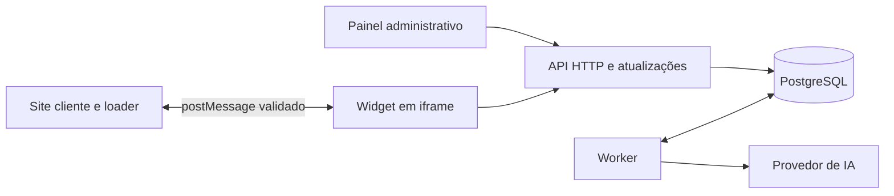

> **Arquivo histórico.** Este documento registra uma revisão anterior e pode não representar o código atual. Consulte [a documentação vigente](../../index.md).

# Plano de implementação orientado pelo SDD

Data: 11/09/2026. Status: planejamento; primeira entrega delimitada conforme orientação do usuário, ainda não implementada.

## 1. Direção e autoridade dos documentos

Construir uma central de suporte multiempresa, incorporada por iframe, com ajuda, conversa persistente, IA baseada no conhecimento publicado e continuidade humana. A prioridade é tornar os dados corretos, os fluxos compreensíveis e a operação simples.

Documentos lidos integralmente:

- [Especificação técnica](../../sdd.md): referência técnica principal para iframe, integração, experiência e resiliência.
- [MVP_REFERENCIA_CLAUDE.md](MVP_REFERENCIA_CLAUDE.md): recorte funcional e critérios de valor.
- [PLANO_CONSTRUCAO_MVP.md](PLANO_CONSTRUCAO_MVP.md): planejamento anterior e requisitos complementares.

Este plano detalha a execução e explicita divergências. Não altera silenciosamente o SDD nem considera mudanças de comportamento aprovadas. As propostas da seção 3 devem ser incorporadas a uma revisão do SDD antes da implementação correspondente. Nenhum código, dependência ou infraestrutura foi criado nesta etapa.

Direção da primeira entrega: **uma página externa instala o snippet, abre o widget da empresa correta e permite abrir, fechar e navegar sem prejudicar a página hospedeira**. Histórico, atendimento humano e IA serão conectados depois. A arquitetura completa descrita neste documento é o destino do MVP; não é pré-requisito para essa primeira prova. A sequência da seção 9 prevalece sobre o cronograma do plano anterior.

## 2. Aplicação dos princípios de DDIA

A consulta incluiu a apresentação oficial de *Designing Data-Intensive Applications*, a prévia pública do capítulo de transações da segunda edição e a apresentação do relatório *Making Sense of Stream Processing*. Não houve leitura integral do livro nesta sessão.

A obra enfatiza escolhas conscientes entre alternativas e limitações; a prévia de transações discute falhas e concorrência; o material sobre streams relaciona eventos e dados derivados. As escolhas abaixo são aplicações propostas para este projeto, não prescrições de stack feitas pelos autores. Referências: [DDIA](https://dataintensive.net/), [Transactions](https://www.oreilly.com/library/view/designing-data-intensive-applications/9781098119058/ch08.html) e [Making Sense of Stream Processing](https://martin.kleppmann.com/2016/05/24/making-sense-of-stream-processing.html).

| Princípio aplicado | Decisão proposta | Evidência esperada |
|---|---|---|
| Confiabilidade diante de falhas | Confirmar mensagens após commit; tarefas duráveis; repetição idempotente | Derrubar processos não perde mensagem confirmada |
| Consistência onde importa | Transações para mensagem, estado, execução de IA e transferência | Corrida entre IA e humano preserva a regra de atendimento |
| Fonte de verdade explícita | PostgreSQL guarda fatos; resumos, índices e contadores são derivados | Derivados podem ser reconstruídos |
| Escalabilidade orientada por carga | Medir conexões, mensagens, consultas, fila e custo por empresa | Aumentar capacidade responde a gargalo observado |
| Simplicidade e manutenção | Monólito modular, poucos processos, contratos explícitos | Uma alteração funcional tem localização previsível |
| Evolução compatível | Migrações incrementais e versão no protocolo do loader | Loader anterior continua compatível durante atualização |

## 3. Ajustes necessários no SDD

| Trecho | Problema | Encaminhamento proposto |
|---|---|---|
| §1.1: isolamento absoluto | O iframe isola documentos, mas o host controla o elemento e pode removê-lo ou alterar suas dimensões | Descrever a fronteira real; testar CSS do host, foco e área clicável |
| §1.2: BroadcastChannel elimina conexões extras | Compartilha mensagens; não fornece eleição de líder. Também depende da partição de armazenamento | Começar com conexão por aba ativa, limitada; usar canal como otimização de sincronização |
| §1.2: canal somente por tenant | Usuários distintos da mesma empresa podem coexistir no navegador | Escopo por instalação e sessão; nunca transmitir credenciais ou histórico pelo canal |
| §2.1 e §6: sanitização antes de conversão | O parser Markdown produz HTML que também precisa ser sanitizado | Interpretar Markdown, validar links e sanitizar HTML final antes da inserção |
| §3: estados de interface e atendimento | `AGENT_TYPING` não define quem controla a conversa; faltam falha e recuperação | Separar estado persistente da conversa, geração e apresentação |
| §3: input bloqueado enquanto aguarda equipe | Impede complementar um atendimento assíncrono | Propor envio de complementos sem reativar IA; manter bloqueio original até revisar o SDD |
| §3: voto reseta para IDLE | Pode sugerir apagamento ou reabertura involuntária | Preservar conversa resolvida; votação muda somente a apresentação |
| §4.2 e §6: SameSite=None garante sessão | Navegadores podem bloquear ou particionar armazenamento de terceiros | Validar estratégia de sessão em navegadores reais; definir degradação explícita |
| §4.2: geração sobrevive ao fechamento | Não acontece automaticamente quando SSE é encerrado | Worker durável independente da conexão do navegador |
| §4.1: navigator.onLine determina conectividade | É apenas um sinal local | Tratar timeout e falhas reais de requisição e permitir nova tentativa |
| §8.1: zero impacto e tamanhos indefinidos | Qualquer script tem custo; falta definir compressão e conjunto de arquivos | Medir bytes transferidos comprimidos e impacto na página externa |

As limitações de armazenamento e comunicação estão documentadas em [cookies de terceiros](https://developer.mozilla.org/en-US/docs/Web/Privacy/Guides/Third-party_cookies) e [Broadcast Channel API](https://developer.mozilla.org/en-US/docs/Web/API/Broadcast_Channel_API).

O SDD prevê SSE para IA e WSS para atendimento humano. Isso permanece como baseline. Recomenda-se avaliar uma simplificação explícita: comandos via HTTP e um fluxo SSE para atualizações, com polling de recuperação. Digitação também pode ser publicada por HTTP. A substituição de WSS exige registrar a revisão; não será assumida durante a implementação.

## 4. Arquitetura mínima



Monorepo TypeScript e monólito modular no backend. API e worker são dois pontos de execução do mesmo produto, com as mesmas regras e migrações. Inicialmente, uma região, um PostgreSQL primário, recursos estáticos em CDN e um provedor de IA. Painel e widget têm builds distintos.

O PostgreSQL concentra dados transacionais, busca textual e fila durável. Uma tabela de jobs escrita na mesma transação do comando resolve o envio inicial de trabalho. Não criar outra outbox com a mesma função. Uma outbox dedicada passa a fazer sentido quando houver entrega para sistemas externos.

Não há necessidade demonstrada de microserviços, Kafka, Kubernetes, banco vetorial separado, event sourcing completo ou múltiplos bancos. Eventos de conversa servem à auditoria e sincronização; o estado atual continua em tabelas relacionais.

### Organização proposta

```text
apps/
  admin/                  interface administrativa
  widget/                 interface do iframe
  loader/                 integração pública sem framework
  api/                    bootstrap HTTP, autenticação e rotas
  worker/                 bootstrap dos consumidores de tarefas
packages/
  backend/
    tenancy/              empresas, membros e instalações
    identity/             sessões e identificação de visitantes
    knowledge/            artigos, publicação e busca
    conversations/        mensagens, leitura e atendimento
    assistance/           recuperação, geração e resumo
    operations/           métricas, auditoria e custos
  contracts/              schemas de entrada/saída e protocolo público
  database/               migrações, conexão e transações
docs/
  decisions/              decisões com alternativas e consequências
  specs/                  requisitos verificáveis por funcionalidade
  runbooks/               recuperação e operação
tests/
  integration/            banco real, autorização e concorrência
  e2e/                    site externo, widget e painel
  evaluations/            perguntas e critérios de qualidade da IA
```

Cada módulo começa com poucos arquivos: casos de uso, regras e consultas. Separar mais somente quando houver responsabilidade real. Evitar repositório genérico, classe base universal, barramento interno obrigatório e diretórios `utils` sem propósito delimitado.

Rotas validam e autorizam a entrada, chamam um caso de uso e traduzem a resposta. Casos de uso definem a transação. Consultas mantêm SQL e filtros explícitos. Módulos usam interfaces públicas dos demais; a definição de schema compartilhada não autoriza escrita arbitrária nas tabelas de outro módulo.

Frontend importa contratos, nunca código de servidor. Regras sensíveis permanecem no backend. Bibliotecas de UI e telemetria só viram pacotes quando houver reutilização concreta. Frameworks, ORM, autenticação e hospedagem serão fixados em decisão curta após validar compatibilidade e operação; não é necessário escolhê-los para definir os limites acima.

## 5. Modelo de dados e invariantes

Manter as entidades funcionais do plano anterior com os seguintes refinamentos:

| Grupo | Modelo proposto |
|---|---|
| Empresa e acesso | `tenants`, `tenant_domains`, `memberships`, `visitor_identities`, `visitor_sessions` |
| Conhecimento | `categories`, `articles`, `article_versions`; artigo aponta para versão publicada |
| Atendimento | `conversations`, `conversation_participants`, `messages`, `conversation_events` |
| Leitura | Cursor `last_read_message_seq` por participante/conversa; atualização monotônica |
| IA | `ai_runs`, referências às versões consultadas e `jobs` duráveis |
| Operação | `feedback`, `audit_logs` e medições de custo por tentativa |

Invariantes obrigatórias:

1. Toda entidade de empresa carrega `tenant_id`. Referências compostas impedem relacionar filhos e pais de empresas diferentes.
2. O servidor deriva o tenant da sessão validada. Um identificador público no loader não concede acesso a conversas.
3. Uma mensagem confirmada tem commit concluído e identificador estável.
4. `UNIQUE(tenant_id, conversation_id, message_seq)` define ordenação na conversa; relógio do cliente não determina ordem.
5. Alocar sequência sob bloqueio da linha da conversa, na mesma transação da mensagem. Eventos duráveis têm sequência própria ordenada por conversa. Não depender de um ID global alocado antes do commit para recuperar eventos sem lacunas.
6. Escritas repetíveis usam chave idempotente por tenant, ator e operação, com hash do payload. Repetição igual devolve o resultado; reutilização com payload diferente retorna conflito.
7. Uma execução de IA produz no máximo uma mensagem final publicada, protegida por unicidade de `ai_run_id`.
8. Estado e versão da conversa são revalidados na publicação da resposta. Transferência invalida a autorização da geração anterior.
9. Busca e IA consultam apenas versões publicadas da empresa. Despublicação bloqueia novas leituras públicas e novos contextos.
10. Voto não apaga histórico; abandono não conta como resolução.

Índices iniciais: conversas por tenant/estado/atualização; mensagens por tenant/conversa/sequência; identidade externa única por tenant; slug único por tenant; jobs pendentes por disponibilidade; índice de busca textual. Adicionar outros com base em consultas medidas.

Autorização por participante é obrigatória mesmo dentro do mesmo tenant. RLS reforça o isolamento por empresa: conexão de aplicação sem `BYPASSRLS`, papel de migração separado e contexto de tenant limitado à transação. Testar reutilização de conexões para impedir vazamento de contexto. Donos de tabelas e superusuários podem contornar políticas, conforme a [documentação de RLS](https://www.postgresql.org/docs/current/ddl-rowsecurity.html).

## 6. Estados e concorrência

Estado persistente da conversa:

```text
ai_active → waiting_human → human_active → resolved
ai_active → resolved
resolved → waiting_human    (reabertura de conversa humana)
resolved → ai_active        (reabertura de conversa atendida pela IA)
```

Reabertura é um comando e um evento, não um estado intermediário indefinido. Encaminhamento solicitado pelo usuário prevalece sobre a opção automática na reabertura.

Estado de execução da IA: `queued → running → completed | failed | cancelled`. Falta de cobertura é um resultado de negócio, não falha de infraestrutura.

Estado local: painel aberto/fechado; view atual; conectividade; envio em andamento; texto parcial. `agent_typing` é indicação efêmera com expiração, sem alterar estado persistente. O compositor humano permanece disponível mesmo quando não há evento de digitação.

### Envio e geração

1. API autentica, autoriza, limita payload e verifica idempotência.
2. Em transação, bloqueia conversa, grava mensagem e evento; se elegível para IA, cria execução e job. No máximo uma geração ativa por conversa.
3. Responde após commit. O cliente representa pendência separadamente de mensagem enviada.
4. Worker reivindica job com lease e número de tentativa. A chamada ao LLM acontece fora da transação.
5. Antes de publicar, nova transação verifica lease/tentativa, estado e versão da conversa, execução e validade das fontes. Grava resultado, mensagem e evento atomicamente.
6. Se houve transferência, guarda o resultado operacional da execução, mas não publica a resposta automática.

### Transferência durante geração

Transferir e finalizar geração devem bloquear a mesma conversa. Se a transferência confirmar primeiro, a resposta fica impedida. Se a publicação confirmar primeiro, ela faz parte do histórico anterior à transferência. O resumo é uma tarefa separada e nunca bloqueia a entrada na fila humana.

Texto parcial já exibido não pode ser desexibido retroativamente como garantia. Após transferência, o cliente interrompe parciais e ignora eventos da versão antiga. A garantia é impedir nova publicação automática após o commit da transferência.

### Recuperação do worker

Jobs têm `available_at`, `attempts`, `lease_until`, `locked_by` e último erro classificado. Um lease expirado permite recuperação; um worker antigo não pode publicar usando tentativa vencida. Consumidores podem usar `FOR UPDATE SKIP LOCKED` em transações curtas, recurso apropriado para tabelas de fila segundo a [documentação do PostgreSQL](https://www.postgresql.org/docs/current/sql-select.html).

Usar retries limitados com backoff e jitter; esgotamento deixa falha visível e opção humana. Entrega de jobs é pelo menos uma vez, com efeitos persistidos idempotentes. Timeout do provedor pode gerar cobrança mesmo sem resposta recebida: não prometer execução ou cobrança exatamente uma vez. Registrar tentativa, estimativa e custo desconhecido quando necessário.

## 7. Sessão, integração e atualização

### Sessão no iframe

- Identificado: backend do cliente emite asserção assinada, curta, com emissor, audiência, tenant, usuário e expiração; servidor do produto valida e cria sessão própria. Nome e e-mail do navegador não autenticam.
- Anônimo: credencial opaca com hash no servidor. Persistência no contexto do iframe depende das capacidades reais de armazenamento; token local também pode ser bloqueado.
- Validar cookies particionados e armazenamento permitido em Chrome, Firefox e Safari/iOS, incluindo modo privado. [CHIPS](https://developer.mozilla.org/en-US/docs/Web/Privacy/Guides/Third-party_cookies/Partitioned_cookies) é uma opção a testar, não garantia universal.
- Quando não houver persistência, manter sessão em memória e informar limitação de retomada. Não prometer histórico anônimo entre dispositivos ou sites diferentes.
- Para clientes que exigem continuidade em ambientes restritivos, prever integração assinada pelo backend cliente. Se retomada anônima persistente for mandatória nesses ambientes, tratar a solução como bloqueador da entrega de histórico em P4, sem bloquear a prova de integração em P1.
- Logout revoga sessão no servidor, limpa estado local e sinaliza outras abas. Durante perda de rede, limpar a UI imediatamente e revogar ao reconectar; revogação instantânea no servidor exige canal disponível ou integração servidor-servidor. Tokens curtos limitam a janela restante.

### Contrato público

API da primeira entrega: `open`, `close`, `on` e `off`, com eventos `ready`, abertura, fechamento e erro. Comandos antes de `ready` entram numa fila limitada. Definir timeout de inicialização e erro observável. `setContext`, `identify` e `logout` entram junto da integração de identidade e conversas em P4.

Envelope do `postMessage`: versão, tipo, `requestId`, identificador da instância e payload validado. Conferir `event.origin`, `event.source` e origem de destino exata. Nunca usar `*` em mensagens com dados. Contexto deve ter allowlist, limites de tamanho e URL sem query/fragmentos por padrão.

CSP `frame-ancestors` é gerada por instalação no servidor, com cache separado por instalação. CORS e origem de embed não substituem autenticação: a API chamada de dentro do iframe vê a origem do widget. A associação ao host depende do handshake e da configuração de instalação; identidade depende de credenciais válidas.

Loader controla dimensões máximas, viewport e restauração de foco ao elemento anterior no host. Widget controla foco interno e ESC. A área fechada não pode interceptar cliques fora do botão. Cores e demais parâmetros são validados, sem aceitar CSS arbitrário.

### Entrega e recuperação

Mensagens e mudanças persistentes podem ser reenviadas: deduplicar por ID e ordenar por sequência. Reconectar busca histórico após o cursor da conversa; cursor expirado provoca recarga paginada. Listas e contadores são reconsultados após reconexão.

SSE/WSS transportam atualizações; o banco guarda o resultado definitivo. Parciais podem ser perdidos e substituídos pela resposta final. Se a API precisar recuperar parciais entre processos, usar buffer temporário limitado por execução e lote, com limpeza; não escrever uma linha durável por token. Notificações podem apenas acordar consumidores, nunca ser a única cópia do resultado.

BroadcastChannel transmite invalidações e logout, sem dados sensíveis. Sua falha não compromete correção. Eleição de aba líder fica para quando limites de conexão justificarem sua complexidade.

## 8. Conhecimento e IA

Uma única busca alimenta Ajuda e recuperação para IA. Começar com busca textual no PostgreSQL e trigramas quando úteis. Contexto tem limite de tamanho e seleção explícita; não enviar a base inteira nem executar RAG no navegador.

Guardar versão de prompt, modelo, artigos/versões recuperados, resultado e uso por execução. Resumos são dados derivados; o histórico original permanece consultável. Draft automático do §7 do SDD é sugestão interna, identificada como rascunho, enviada somente por ação do atendente.

Citações devem apontar para artigos efetivamente recuperados e acessíveis. Preferir IDs estruturados validados pelo servidor; renderizar `hub://article/...` apenas como navegação interna. Uma citação válida não comprova que todas as afirmações estejam corretas. Avaliar fidelidade, tratamento de ambiguidade e falta de cobertura.

Conteúdo e perguntas são entradas não confiáveis. Não disponibilizar ferramentas transacionais à IA no MVP. Markdown parcial e final seguem a mesma política segura. Se a fonte for despublicada durante a geração, invalidar o contexto antes de publicar; citações antigas passam a mostrar indisponibilidade sem expor conteúdo retirado.

Limitar geração por empresa, sessão e conversa. Reservar capacidade de orçamento atomicamente antes de agendar e reconciliar uso ao terminar; não somar apenas custos concluídos quando existem tarefas concorrentes. Testar IA deve ter métricas separadas do atendimento real.

## 9. Sequência de implementação

Cada fatia segue: especificação verificável → decisão necessária → contratos e migração → fluxo completo → testes de risco → documentação e demonstração. Não avançar por quantidade de telas prontas.

| Etapa | Entrega demonstrável | Dependência | Critério de saída |
|---|---|---|---|
| P0 — preparar a prova | Especificar snippet, configuração pública por instalação, protocolo, origens, navegação e navegadores-alvo | Este plano | Contrato e critérios de P1 registrados; preparação técnica, sem entrega independente |
| P1 — primeira entrega: integração externa navegável | Snippet, loader, iframe, handshake, identidade da empresa, abrir/fechar e navegação Início/Mensagens/Ajuda | P0 | Página de outra origem comprova todos os critérios de aceite abaixo com duas empresas |
| P2 — fundação multiempresa | Autenticação administrativa, memberships, migrações e isolamento | P1 | Duas empresas e dois usuários por empresa não cruzam dados |
| P3 — central de ajuda | Configuração editável, publicação, busca e leitura interna conectadas à navegação de P1 | P2 | Empresa publica artigo e visitante encontra somente conteúdo autorizado |
| P4 — histórico e continuidade humana | Sessão, identificação, logout, conversa persistente, inbox, envio, leitura, resolução e reabertura | P2/P3 | Visitante retoma histórico autorizado e recebe resposta humana; repetir envio e recarregar não duplica nem perde mensagem |
| P5 — IA durável | Jobs, busca, geração, fontes, fallback e Testar IA | P3/P4 | Fechar aba ou reiniciar worker preserva resultado; avaliação atende critérios |
| P6 — transição e apoio | Transferência concorrente, resumo, draft e CSAT | P5 | IA não publica após transferência; falha do resumo não bloqueia equipe |
| P7 — piloto operável | Métricas, limites, alertas, restauração, E2E e onboarding | P1–P6 | Critérios funcionais e de recuperação demonstrados |

Transferência e restrições de concorrência são detalhadas antes de P4/P5 e implementadas nessa base; P6 integra e prova o fluxo completo. Segurança e observabilidade entram em cada etapa, com consolidação em P7.

### P1 — escopo e evidência da primeira entrega

**Resultado demonstrável:** instalar somente o snippet em uma página hospedeira de outra origem, abrir a central da empresa indicada e percorrer Início, Mensagens e Ajuda, preservando o funcionamento da página externa.

Entregáveis:

- Loader público sem framework e widget com build próprio, renderizado em iframe cross-origin.
- Snippet com identificador público de instalação, sem segredos. Duas instalações de teste associadas a empresas distintas, cada uma com nome, saudação, cor e origens permitidas. Configuração estática controlada no servidor é suficiente nesta etapa.
- Botão flutuante, painel responsivo, navegação interna e API pública mínima. Mensagens apresenta estado vazio; Ajuda pode usar conteúdo demonstrativo identificado como tal. Nenhuma dessas telas depende de atendimento conectado.
- Página externa de demonstração com CSS próprio, links, campo de texto, botão com contador e conteúdo rolável, além de instruções para instalar e reproduzir a prova.
- Testes de integração do protocolo e E2E na página externa; registro dos navegadores, viewports, resultados e medidas de carregamento.

Critérios de aceite obrigatórios:

1. **Instalação real:** a página externa carrega o loader pelo snippet e o iframe de outra origem, sem importar componentes do painel administrativo. Repetir a inicialização da mesma instalação não duplica botão ou iframe.
2. **Empresa correta:** a instalação A exibe apenas a identidade/configuração pública de A; a instalação B exibe a de B, inclusive após recarregar ou alternar as demonstrações. Instalação desconhecida ou desativada falha de forma controlada, sem usar outra empresa como fallback. Essa prova cobre configuração pública; autorização de histórico será validada em P4.
3. **Abrir, fechar e navegar:** botão e API abrem/fecham o painel; Início, Mensagens e Ajuda são acessíveis; fechar e reabrir na mesma página preserva a view local. A navegação interna não altera URL, histórico de navegação ou rota da página hospedeira. Não há promessa de persistência após recarregar nesta etapa.
4. **Cliques e rolagem:** fechado, somente a área do botão intercepta cliques; aberto, somente a área visível do widget. Links, formulário, contador e rolagem do host continuam funcionando nas áreas não cobertas, sem camada invisível, deslocamento do layout ou bloqueio global da rolagem. A rolagem interna mantém a navegação do widget acessível.
5. **Foco e teclado:** controles têm rótulos e foco visível; é possível abrir, navegar e fechar por teclado. ESC dentro do iframe fecha o painel. Abertura por controle do host devolve o foco a esse controle ao fechar; abertura pelo botão do widget devolve ao próprio botão. O foco não fica preso em conteúdo oculto.
6. **Layout e isolamento:** desktop e celular mantêm botão, navegação e fechamento acessíveis dentro da viewport, inclusive após redimensionar. CSS da página não altera o conteúdo interno do iframe e estilos do widget não alteram elementos do host. Preferência de movimento reduzido é respeitada. O host continua tendo controle sobre o elemento iframe; não se promete isolamento absoluto.
7. **Integração validada:** instalação rejeita origem não permitida; mensagens com origem, janela emissora, instância, versão ou payload inválidos são ignoradas. Mensagens válidas usam destino explícito. Apenas identificadores e configuração pública são necessários.
8. **Falha e impacto:** simular falha de carregamento e timeout não deixa área invisível capturando cliques nem foco preso; erro é observável pela integração. Comparar a mesma página com e sem snippet, registrar bytes e tarefas longas atribuíveis ao loader e verificar ausência de mudanças visuais no host. Metas de transferência da seção 10 precisam ser atendidas ou revisadas explicitamente com evidência.

**Fora de P1:** histórico persistente, envio real de mensagens, sessão de visitante, cookies de continuidade, identificação assinada, logout, autenticação administrativa, CRUD de conhecimento, inbox, atendimento humano, SSE/WSS, workers e chamadas de IA. Esses recursos seguem nas etapas posteriores; não condicionam o aceite da primeira entrega.

**Roteiro de demonstração:** usar os controles do host → instalar snippet A → abrir → conferir empresa A → navegar pelas três áreas → fechar por botão e por ESC → reutilizar os controles do host → reabrir → repetir com instalação B → executar os casos de origem/instalação inválida e falha de carregamento. Repetir em desktop e celular na matriz definida em P0. Registrar evidências antes de declarar P1 concluída.

O prazo anterior de 7 semanas mais 1 de estabilização é uma hipótese para duas pessoas em tempo integral. Não é compromisso: reestimar após P1 com equipe real, hospedagem e matriz de navegadores. Planejar por dependência e critério de saída, sem converter incerteza em datas artificiais.

## 10. Verificação e operação

Testes prioritários:

- Integração com PostgreSQL real: tenant, participante, chaves compostas, RLS, idempotência, sequência e corrida entre transferência e geração.
- Falhas controladas: API cai após commit antes da resposta; worker cai antes/depois da chamada externa; lease expira; evento se repete; navegador perde rede; resumo falha.
- E2E: domínio externo autorizado/proibido, instalação, artigo, conversa, IA, humano, logout, troca de usuário, retorno e leitura em múltiplas abas.
- Segurança da renderização: HTML/Markdown malicioso, URL inválida, origem falsa e payload excessivo no postMessage.
- Acessibilidade: teclado, foco dentro/fora do iframe, leitor de tela, movimento reduzido e viewport móvel.
- IA: conjunto versionado com cobertura, ambiguidade, ausência de conteúdo e tentativas de desvio; casos críticos devem passar. Definir limiar agregado antes de selecionar modelo.

Loader menor que 3 KB, JavaScript do iframe menor que 80 KB e CSS menor que 20 KB são metas propostas de transferência gzip, incluindo dependências necessárias ao fluxo inicial. Registrar também tamanho bruto e custo das rotas carregadas depois. Se a medição inviabilizar esses valores, revisar explicitamente o SDD.

Antes do piloto, fixar perfil de carga: empresas, sessões/abas simultâneas, mensagens por segundo, tamanho de artigos, retenção e gerações concorrentes. Medir p95 de API, busca, primeira parcial e resposta final separadamente. Nenhuma capacidade numérica foi validada nesta etapa.

Logs estruturados: request, tenant, conversa, execução, tentativa e erro classificado; sem tokens ou conteúdo integral por padrão. Métricas: atraso e profundidade da fila, retries, erros, conexões, latência, custo conhecido/desconhecido e resultados do atendimento.

Backups automáticos e restauração ensaiada; definir RPO/RTO antes do piloto. Migrações preferem expandir → migrar dados → contrair; rollback de código deve ser compatível com schema durante a janela de implantação. Para alteração destrutiva, ter restauração ou correção adiante documentada, sem presumir que toda migração seja reversível.

Retenção e exclusão abrangem mensagens, versões de artigos, resumos, dados de IA, logs e expiração de backups. Dados derivados também devem ser eliminados ou reconstruídos sem o conteúdo excluído.

## 11. Evolução conforme evidência

| Sinal observado | Próximo passo |
|---|---|
| API atinge limite de CPU/conexões | Replicar API, ajustar pool e limites de conexões de atualização |
| Aumenta idade de jobs | Aumentar workers com limite por tenant e pelo provedor |
| Busca textual falha na avaliação | Melhorar artigos e consulta; comparar recuperação semântica antes de adotar |
| Consultas analíticas afetam atendimento | Pré-calcular agregados; depois considerar réplica/projeção |
| Fila disputa recursos do banco | Medir índices, limpeza e polling; avaliar broker com outbox se necessário |
| Um módulo exige operação realmente independente | Avaliar extração com contrato, responsável e custo definidos |

Sem réplica de leitura no caminho crítico inicialmente: histórico após envio deve refletir a escrita confirmada. Sem particionamento distribuído ou multi-região antes de haver requisito comprovado.

## 12. Decisões restantes

Recomendação arquitetural pronta: monólito modular, PostgreSQL como fonte de verdade, processamento durável, isolamento explícito e implementação em fatias completas.

Para fechar P0: registrar somente decisões necessárias à prova externa — origem de hospedagem do loader/iframe, formato do snippet e da configuração pública, allowlist, handshake, API mínima, navegação, comportamento de foco/dimensões, navegadores-alvo e medição do carregamento. Reaproveitar a base TypeScript existente onde aplicável.

Antes de P2/P3: decidir persistência, migrações e autenticação administrativa. Antes de P4: validar garantia de sessão em navegadores reais, identidade/logout e SSE+WSS versus SSE unificado. Antes de P5: definir provedor/modelo, orçamento e avaliação. Antes de P7: fechar carga inicial, retenção e metas de recuperação. Cada decisão deve registrar contexto, escolha, alternativa descartada e condição de revisão.

O [plano de instalação por snippet](plano-instalacao-snippet.md) detalha os contratos de P0, a sequência de implementação e a matriz de verificação de P1.

Próxima execução planejada: implementar P1 conforme esse detalhamento até demonstrar seus critérios de aceite na página externa. Esta revisão altera o planejamento; a prova ainda não foi implementada nem executada.
