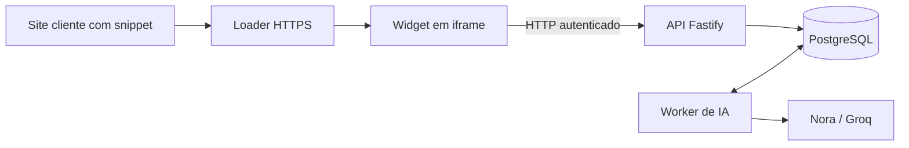

> **Arquivo histórico.** Este documento registra uma revisão anterior e pode não representar o código atual. Consulte [a documentação vigente](../../index.md).

# Plano de hospedagem e conexão de mensagens, histórico e IA

Plano de 11/09/2026. Atualização em 14/09/2026: contratos, persistência, worker e widget implementados; resultados em [verificação do chat persistente](../verification/verificacao-chat-persistente.md). Homologação HTTPS e piloto ainda não publicados; a avaliação real de qualidade da Nora também permanece pendente. Configuração e limites em [operação do chat persistente](operacao-chat-persistente.md).

## 1. Objetivo e recorte

Publicar o Support Hub em HTTPS e permitir que um visitante, em um site externo autorizado, envie mensagens pelo widget, receba respostas da Nora e retome seu histórico autorizado. As mensagens confirmadas e as tarefas de IA devem sobreviver a recarregamento, fechamento da página e reinício dos processos.

Começar com uma empresa real no piloto, mantendo isolamento multiempresa desde o modelo de dados. Validar com duas empresas e dois visitantes por empresa nos testes.

Este documento detalha um recorte das etapas P2–P5 e da preparação operacional P7 do [plano principal](PLANO_IMPLEMENTACAO_SDD.md). Dá continuidade à [instalação por snippet](plano-instalacao-snippet.md), cuja evidência local está na [verificação do snippet](../verification/verificacao-snippet.md).

Decisões propostas para esta entrega:

- Hospedagem no Render, PostgreSQL gerenciado e Groq como provedor de IA.
- API, loader, CSS e iframe no mesmo domínio do produto.
- Envio por HTTP e consulta periódica do resultado enquanto houver resposta pendente. A primeira versão exibe a resposta completa; streaming SSE entra depois.
- Geração executada em worker com tarefas persistidas no PostgreSQL. Adiar streaming não elimina a necessidade de processamento durável.
- Cadastro inicial de instalações e artigos por comando administrativo restrito. Editor de artigos, autenticação administrativa completa e inbox ficam em entregas próprias.

O recorte antecipa chat com IA sem concluir todo P3/P4 do plano principal. Não declara atendimento humano, SSE/WSS ou o MVP completo como entregues. Registrar a entrega incremental de transporte na revisão do SDD antes da implementação correspondente, sem remover seus requisitos futuros.

## 2. Base existente e lacunas

| Parte | Situação verificada | Trabalho desta etapa |
|---|---|---|
| Loader e iframe | Instalação por script, identidade por instalação, navegação e handshake | Preservar contrato e validar em HTTPS externo |
| Instalações | Fixtures locais em `apps/api/src/embed.ts`; produção sem instalações por padrão | Carregar instalações e origens reais do banco |
| Mensagens do widget | View demonstrativa em `apps/widget/src/tela/messages.ts` | Compositor, histórico, envio e estados de falha |
| API de chat | `/api/chat` recebe histórico do navegador e usa empresa fixa | Criar fluxo autenticado por sessão; histórico e empresa resolvidos pelo servidor |
| Nora | `generateNoraResponse` em `apps/api/src/ia/agents/nora.ts`, com busca de conhecimento e Groq | Reutilizar no worker com contexto da conversa e registrar execução |
| Conhecimento | JSON local, busca textual e publicação aplicada ao reiniciar | Migrar para PostgreSQL mantendo o contrato `KnowledgeSearch` |
| Persistência | Sem banco de conversas ou fila durável | Migrações, repositórios, jobs e recuperação |
| CSP do iframe | `default-src 'none'`, sem `connect-src` | Autorizar `connect-src 'self'` para chamadas à API |
| Painel | Desenvolvimento usa proxy Vite para `/api` | Publicação posterior exige endereço/proxy real e autenticação |

## 3. Hospedagem proposta



| Recurso | Serviço proposto | Responsabilidade |
|---|---|---|
| API e assets do embed | Render Web Service Node.js | `/loader.js`, `/loader.css`, `/assets/*`, `/embed/:id` e API |
| Banco | Render Postgres na mesma região | Instalações, sessões, conversas, artigos e jobs |
| Worker | Render Background Worker | Consumir jobs e persistir respostas, independente do navegador |
| Painel, quando integrado | Render Static Site | Publicar `apps/admin/dist` com configuração de API e acesso autenticado |

Usar serviços pagos para o piloto operacional. O Web Service gratuito pode adormecer após 15 minutos e levar cerca de um minuto para retornar; o Postgres gratuito expira após 30 dias e não oferece backups. Essas condições não atendem à continuidade prevista aqui. [Limites do Render gratuito](https://render.com/docs/free).

Configuração inicial da API:

| Campo | Valor proposto |
|---|---|
| Diretório de trabalho | Raiz do monorepo |
| Build | `npm ci --include=dev && npm run build` |
| Start | `npm run start -w @support-hub/api` |
| Health check | `/api/health`, evoluído para readiness do banco |
| Runtime | Fixar versão LTS do Node compatível com o repo e validada no build |
| Rede | `HOST=0.0.0.0`; respeitar `PORT` fornecida pela plataforma |
| Domínio ilustrativo | `https://widget.seudominio.com` |

O worker terá workspace, build e comando próprios, ainda a criar; incluí-los no build da raiz. Usar a mesma revisão de código da API e configurar implantação compatível entre ambos. O Render suporta [Web Services](https://render.com/docs/web-services) e [Postgres gerenciado](https://render.com/docs/postgresql-creating-connecting).

Variáveis previstas: `NODE_ENV=production`, `DATABASE_URL`, `GROQ_API_KEY`, `GROQ_MODEL` e configurações de TTL, limites e concorrência. Esses últimos nomes serão fixados no contrato de configuração. Manter a chave Groq apenas no processo que chama o provedor; não incluí-la nos builds do frontend.

Criar migrações versionadas e executá-las uma vez por implantação, antes da ativação dos processos. Garantir compatibilidade com a versão anterior durante o deploy. Não executar migrações concorrentes ao iniciar cada réplica. Manter dados persistentes no PostgreSQL, com backups e teste de restauração.

## 4. Instalação, sessão e autorização

O snippet continua contendo somente URL e identificador público:

```html
<script
  src="https://widget.seudominio.com/loader.js"
  data-installation-id="inst_cliente_123"
  defer
></script>
```

Os valores acima são ilustrativos. Cadastrar domínio HTTPS exato do cliente, empresa, nome, saudação, cor e estado ativo antes de gerar o snippet real. Preservar 404 para instalação desconhecida e 403 para desativada, sem fallback entre empresas.

Sessão anônima proposta:

1. Após o handshake, o widget solicita uma sessão vinculada à instalação ativa.
2. A API emite credencial opaca aleatória e armazena somente seu hash, com expiração e revogação.
3. O widget apresenta a credencial nas chamadas de conversas. A API resolve empresa e visitante pela sessão validada.
4. Toda consulta verifica empresa e propriedade da conversa, inclusive entre visitantes da mesma empresa.
5. Credenciais não aparecem em URLs, logs, eventos públicos ou no snippet. Usar respostas privadas com `Cache-Control: no-store`.

A origem autorizada restringe a incorporação; não autentica uma pessoa. A API chamada pelo iframe vê a origem do produto. Não confiar em `companyId`, e-mail, origem declarada no corpo ou ID de conversa como prova de acesso. Proteger emissão pública de sessões e chamadas de IA contra abuso.

Persistência de sessão: testar armazenamento no contexto do iframe com escopo por instalação, cookies e modos restritivos antes de fixar o mecanismo. Não assumir que cookies de terceiros ou `localStorage` estejam sempre disponíveis. Se o navegador bloquear persistência, manter sessão em memória e informar que a retomada após sair não está disponível naquele ambiente. Não guardar a credencial no site cliente nem transmiti-la ao loader.

Critério do piloto: retomada anônima no mesmo site e navegador nos ambientes explicitamente validados. Continuidade entre dispositivos ou identidade de usuário autenticado exige integração assinada pelo backend do cliente e fica fora deste recorte. Se um navegador obrigatório não permitir a retomada exigida, resolver essa integração antes de declarar suporte a ele.

## 5. Modelo de dados mínimo

Usar `tenant_id` no banco para a empresa; mapear explicitamente ao `companyId` dos contratos existentes.

| Tabela | Dados e invariantes principais |
|---|---|
| `tenants` | Empresa e estado ativo |
| `installations` | Empresa, ID público, identidade visual, origens HTTPS e estado |
| `visitor_sessions` | Empresa, instalação, visitante, hash da credencial, expiração e revogação |
| `conversations` | Empresa, visitante, instalação, estado, versão e próxima sequência |
| `messages` | Empresa, conversa, sequência, autor, conteúdo e horário do servidor |
| `idempotency_keys` | Empresa, ator, operação, chave, hash do payload e resultado |
| `articles` / `article_versions` | Conteúdo e versões; referência explícita à versão publicada |
| `ai_runs` | Pergunta de origem, estado, modelo, versão do prompt, fontes, uso e erro |
| `jobs` | Execução, disponibilidade, tentativa, lease, proprietário e erro classificado |

Regras de consistência:

- Referências compostas impedem relacionar registros de empresas distintas.
- Ordenar mensagens por sequência alocada sob bloqueio da conversa, não pelo relógio do navegador.
- Confirmar envio somente depois de commit; pergunta, execução e job são criados atomicamente.
- Repetição com a mesma chave e payload devolve o resultado existente; payload diferente retorna conflito.
- Uma execução publica no máximo uma resposta final, com restrição única por `ai_run_id`.
- Uma conversa tem no máximo uma geração ativa. Envios simultâneos recebem conflito explícito e preservam o rascunho do usuário.
- Implementar RLS como defesa adicional, com papel de aplicação sem bypass, contexto restrito à transação e teste de reutilização de conexões. Autorização por visitante continua obrigatória.

## 6. API proposta

Criar rotas próprias para o widget. O atual `/api/chat` não será exposto em produção como atalho sem sessão para a Groq; mantê-lo restrito ao desenvolvimento ou migrá-lo para autenticação adequada.

| Método e rota | Resultado |
|---|---|
| `POST /api/widget/sessions` | Criar sessão anônima para instalação ativa |
| `DELETE /api/widget/session` | Revogar sessão atual e limpar estado local |
| `GET /api/widget/conversations` | Listar conversas pertencentes ao visitante |
| `POST /api/widget/conversations` | Criar conversa, com chave idempotente |
| `GET /api/widget/conversations/:id/messages` | Histórico paginado por sequência e estado da geração ativa |
| `POST /api/widget/conversations/:id/messages` | Persistir pergunta e agendar resposta; retornar IDs, sequência e estado |
| `POST /api/widget/conversations/:id/ai-runs/:runId/retry` | Reagendar falha recuperável, com autorização e idempotência |

Definir schemas de request, response e erro em `packages/contracts`. Limite inicial de pergunta: 500 caracteres, alinhado ao endpoint existente. Paginação com limite máximo e cursor validado. Erros distinguem sessão expirada, recurso indisponível, envio concorrente, limite de uso e falha recuperável.

O navegador envia somente a nova pergunta e a chave idempotente. Não aceita escolher empresa, escrever mensagens do assistente ou substituir o histórico armazenado.

## 7. Fluxo de mensagens e IA durável

1. O widget mostra a pergunta como pendente e envia o comando autenticado.
2. A API valida sessão, instalação, propriedade, limites e idempotência.
3. Em transação curta, grava pergunta, execução e job. Retorna confirmação de persistência com a geração em fila.
4. O worker reivindica o job com lease e número de tentativa. Carrega histórico limitado do banco e artigos publicados da empresa.
5. Executa `generateNoraResponse` fora da transação, preservando os limites de buscas, passos, saída e timeout já existentes até revisão motivada por avaliação.
6. Antes de publicar, revalida lease, tentativa, estado da conversa e publicação das fontes. Grava resposta e conclusão atomicamente.
7. O widget consulta novas mensagens enquanto aguarda, com intervalo limitado e backoff em falhas. Ao reabrir ou recuperar rede, busca o estado definitivo no banco.

Separar fechamento visual de cancelamento: fechar o widget ou destruir o iframe não cancela o job. Em crash, recuperar leases expirados. Um worker antigo não pode publicar depois de perder seu lease. Repetir a chamada ao provedor pode gerar cobrança adicional; garantir idempotência da resposta persistida, sem prometer cobrança exatamente uma vez.

Falhas de rede após commit são recuperadas reenviando a mesma chave. Timeout ou erro da IA preserva a pergunta e mostra estado de falha com nova tentativa controlada. Não criar loops automáticos ilimitados nem manter transação de banco aberta durante a chamada externa.

A busca deve manter a interface `KnowledgeSearch`, agora apoiada no PostgreSQL e filtrada por empresa/publicação antes de ranquear. Importar os artigos existentes preservando IDs e versões. Não acrescentar banco vetorial nesta etapa; avaliar qualidade da recuperação textual primeiro.

Registrar modelo, prompt, fontes/versões, tentativas, tokens e duração. Aplicar limites por sessão, empresa e concorrência, com reserva atômica de capacidade antes de agendar. A chave do provedor permanece no backend, conforme a [orientação da Groq](https://console.groq.com/docs/production-readiness/security-onboarding).

## 8. Experiência do widget

- Lista de conversas, abertura da conversa e histórico paginado.
- Campo de mensagem com rótulo, limite, envio por botão e teclado; preservar rascunho em erro recuperável.
- Distinguir envio pendente, mensagem confirmada, resposta em preparação e falha da IA.
- Atualizar estado ao reabrir e manter ordenação sem duplicatas após reconexão.
- Renderizar texto com segurança. Se houver Markdown, converter e sanitizar o HTML final e validar protocolos dos links.
- Preservar navegação, ESC, restauração de foco, responsividade e funcionamento do host.
- Adicionar `connect-src 'self'` à CSP do iframe. As chamadas saem do iframe para a API do produto; não exigem liberar o domínio da Groq no cliente. [Diretiva `connect-src`](https://developer.mozilla.org/en-US/docs/Web/HTTP/Reference/Headers/Content-Security-Policy/connect-src).
- Sem cobertura de conhecimento, informar a limitação. Só oferecer contato externo se houver canal real configurado; não simular fila humana ainda inexistente.

## 9. Sequência de execução e critérios de saída

| Etapa | Entrega | Dependência | Critério de saída |
|---|---|---|---|
| E1 — contratos e decisões | Configuração de deploy, schemas, estados, estratégia de sessão e registro do recorte HTTP | Este plano | Decisões documentadas e cenários de erro definidos |
| E2 — persistência e instalações | Migrações, conexão, isolamento, cadastro restrito e importação de artigos | E1 | Banco real separa duas empresas; produção carrega somente instalações cadastradas |
| E3 — sessão e histórico | Sessões, conversas, envio persistente e paginação | E2 | Visitante retoma dados autorizados; repetição de envio não duplica |
| E4 — Nora durável | Worker, fila, busca por empresa, execução e recuperação | E3 | Fechar aba e reiniciar worker preservam pergunta e resultado recuperável |
| E5 — widget conectado | Compositor, histórico, consulta de resultado e tratamento de falhas | E3/E4 | Fluxo completo em host externo com IA e sem regressão de foco/navegação |
| E6 — homologação HTTPS | API, worker e banco publicados em ambiente de teste | E5 | Duas instalações em hosts HTTPS distintos passam os testes de isolamento e retomada |
| E7 — piloto operável | Uma empresa real, limites, alertas, backup, restauração e documentação | E6 | Critérios obrigatórios abaixo comprovados e limitações registradas |

Manter ambiente e banco de homologação separados de produção. Adicionar `render.yaml`, comandos de migração e operação, `.env.example` atualizado e instruções do snippet durante a implementação. Não incluir credenciais nos arquivos versionados.

O painel estático não bloqueia este recorte. Quando publicado, configurar URL/proxy de API e autenticação real antes de expor dados administrativos; o proxy Vite atual não existe no build de produção.

## 10. Validação obrigatória

### Banco, API e recuperação

- [ ] Duas empresas não acessam mensagens, artigos, sessões ou execuções uma da outra.
- [ ] Dois visitantes da mesma empresa não acessam conversas um do outro.
- [ ] Sessão expirada/revogada e instalação desativada são rejeitadas também nas rotas de chat.
- [ ] Chave idempotente repetida não duplica pergunta, job ou resposta; payload diferente gera conflito.
- [ ] Queda após commit, antes da resposta HTTP, permite recuperação sem perda ou duplicação.
- [ ] Crash antes/depois da chamada ao provedor, lease expirado e worker atrasado não duplicam publicação.
- [ ] Histórico, ordenação e paginação continuam corretos após reiniciar API e banco.
- [ ] RLS e contexto de conexões não vazam empresa entre requisições.
- [ ] Artigos de outra empresa, rascunhos e fontes despublicadas durante geração não viram novo contexto/resposta publicada.

### Widget e IA

- [ ] Envio, resposta, fechar/reabrir, recarregar e retomar funcionam no contexto externo autorizado.
- [ ] Falhas de rede, timeout, limite de uso e falha do provedor têm estados claros e tentativa controlada.
- [ ] Chromium, Firefox e WebKit passam em desktop e móvel; Safari/iOS real e modo privado têm evidência própria.
- [ ] Bloqueio de armazenamento de terceiros apresenta degradação explícita, sem associar outro visitante.
- [ ] Conteúdo malicioso não executa scripts nem abre protocolos perigosos.
- [ ] Casos de IA cobrem dúvida respondível, continuação, ambiguidade, falta de cobertura e tentativa de acessar outra empresa.
- [ ] Testes automatizados usam provedor simulado; avaliação controlada na Groq mede qualidade, latência e uso reais separadamente.
- [ ] Metas gzip existentes são medidas: loader <3 KB, JS inicial do iframe <80 KB e CSS <20 KB, ou revisão justificada no SDD.

### Hospedagem e operação

- [ ] Certificado HTTPS, domínio, CSP e carregamento de assets funcionam sem conteúdo misto.
- [ ] Site permitido funciona; site proibido e instalação inválida falham sem configuração de outra empresa.
- [ ] Nenhuma chave ou credencial aparece em bundle, snippet, URL ou log.
- [ ] Migração é executada uma vez e API/worker permanecem compatíveis durante atualização.
- [ ] Reinício do worker recupera jobs; readiness detecta indisponibilidade do banco.
- [ ] Logs identificam requisição, empresa, conversa e execução sem conteúdo integral por padrão.
- [ ] Métricas mostram falhas, latência, idade da fila, retries, uso e limite por empresa.
- [ ] Backup foi restaurado em ambiente separado; RPO/RTO e retenção/exclusão foram definidos antes do piloto.

Executar `npm run check`, `npm test`, `npm run build`, `npm run sizes`, integração com PostgreSQL real e E2E do snippet. Criar comandos próprios para worker, migração e testes de banco. Registrar resultados efetivamente executados em novo relatório de verificação, distinguindo testes simulados, homologação HTTPS e aparelhos reais.

## 11. Decisões a fechar durante a implementação

| Decisão | Momento necessário |
|---|---|
| Domínio do produto, hosts do piloto e conta Render | Antes de criar/publicar infraestrutura |
| Região e orçamento para API, worker, banco e Groq | Antes de contratar recursos |
| Navegadores obrigatórios e comportamento de retomada | E1; validar antes de fechar E3 |
| Ferramenta de migração e cliente PostgreSQL | E1/E2, escolhidos por simplicidade e compatibilidade |
| TTL, retenção, exclusão, limites e concorrência | Antes de homologação com dados reais |
| Modelo e critérios de qualidade da Nora | Antes da avaliação real e do piloto |
| RPO/RTO, alertas e responsável operacional | Antes de E7 |

Essas decisões não impedem preparar contratos, migrações e testes locais. Este documento não cria serviços, contrata planos nem publica dados.

## 12. Fora desta etapa

Streaming SSE, WebSocket, atendimento humano, transferência, CSAT, anexos, edição administrativa de conhecimento, autenticação administrativa completa, identificação assinada de clientes, continuidade entre dispositivos, busca vetorial e operação em múltiplas regiões.

Entregar esta etapa significa demonstrar **snippet HTTPS → sessão autorizada → mensagem persistida → Nora com conhecimento da empresa → resposta persistida → retomada do histórico**, com recuperação de falhas e limites operacionais comprovados.
