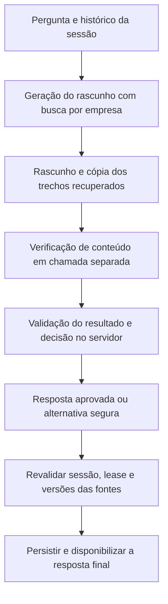

# Plano de qualidade e verificação das respostas da Nora

Data: 14/09/2026. Status: Etapas 1–3 implementadas; Etapas 4–5 pendentes.

## 1. Objetivo

Adicionar uma etapa de verificação entre a geração e a publicação da resposta da Nora. A resposta deve respeitar a pergunta atual, o escopo do suporte e as informações dos trechos recuperados naquela interação. Quando não for possível aprová-la, o servidor deve escolher uma saída conservadora.

O documento foi criado inicialmente como plano. O corpus, o fluxo verificável e sua integração ao worker/serviço estão implementados, conforme [avaliação de qualidade](avaliacao-qualidade-nora.md). O verificador e o chat foram testados com provedor simulado e PostgreSQL real. Novas chamadas pagas à Groq e implantação ainda não foram executadas.

Uma segunda avaliação por IA pode reduzir erros, mas também pode falhar. A aprovação depende de testes, avaliação humana e resultados medidos; não representa garantia geral de ausência de alucinações.

## 2. Problema comprovado

A [verificação do chat persistente](verificacao-chat-persistente.md) registrou duas falhas mesmo após o reforço do prompt para `rag-agent-v3`:

| Caso | Comportamento observado | Comportamento esperado |
|---|---|---|
| Recuperação de senha | Acrescentou abrir o link para criar uma nova senha, além dos passos documentados. | Explicar como solicitar o link e sua validade; encerrar no último passo descrito no artigo. |
| Seguro para viagem à Antártida | Reconheceu a falta de cobertura, mas pediu detalhes da viagem. | Informar brevemente o escopo do suporte e encerrar o assunto externo. |

O artigo de senha documenta acessar a tela de login, selecionar “Esqueci minha senha” e o envio de um link válido por 30 minutos ao e-mail cadastrado. Não documenta os procedimentos posteriores.

O script atual testa três perguntas e registra respostas, fontes, uso e duração. Uma chamada bem-sucedida não é, por si só, aprovação de qualidade.

## 3. Escopo

- Criar casos de avaliação com afirmações permitidas e proibidas.
- Preservar os trechos usados na geração e identificar quais sustentam a resposta final.
- Verificar fundamentação, pertinência, continuidade da conversa e respeito ao escopo.
- Aplicar uma decisão de publicação no servidor, incluindo respostas alternativas seguras.
- Integrar o fluxo ao worker persistente e ao serviço de chat usado em desenvolvimento.
- Medir qualidade, falhas do verificador, tokens e latência.
- Corrigir artigos incompletos somente com informações confirmadas sobre o produto.

Não fazem parte desta etapa: embeddings, treinamento de modelo, troca obrigatória de provedor, atendimento humano funcional, redesign do widget ou publicação na Render. A preparação operacional continua no [plano de hospedagem e histórico](plano-hospedagem-mensagens-historico-ia.md).

## 4. Fluxo proposto

O rascunho e o parecer interno não chegam ao widget. O worker continua gerando fora da transação do banco e publicando a mensagem final de forma atômica.

### 4.1. Evidências da interação

- Manter a empresa definida pelo servidor; usuário e modelo não escolhem o tenant.
- Usar como evidência apenas os trechos efetivamente entregues à Nora nesta interação.
- Identificar cada trecho por artigo, versão e chunk, preservando seu texto exato.
- Remover duplicações entre buscas sem misturar versões diferentes.
- Separar fontes recuperadas de fontes que sustentam o texto publicado.
- Usar o histórico para compreender intenção e negações, não para comprovar fatos do produto.
- Tratar comandos contidos em artigos e mensagens como conteúdo, sem permitir que alterem a política de verificação.

Na implementação da Etapa 2, `generateNoraDraft` retorna `sources` e snapshots imutáveis em `evidence`, sem duplicações por empresa/artigo/versão/chunk. Essa lista, sozinha, não comprova fundamentação. O novo fluxo verificado separa fontes recuperadas de fontes de suporte. Os limites continuam sendo duas buscas, três etapas de geração e até quatro trechos/5.000 caracteres em cada retorno de contexto.

### 4.2. Verificador separado

Criar um prompt versionado e uma chamada sem ferramentas externas. O verificador recebe a pergunta, o histórico necessário, o rascunho completo e as evidências da interação. Examina também frases sociais e de esclarecimento: classificar uma resposta como “social” não pode liberar afirmações sobre o produto sem respaldo.

O retorno estruturado deve conter:

- Decisão: `approve`, `reject` ou `uncertain`.
- Motivos enumerados, como `unsupported_claim`, `irrelevant_answer`, `out_of_scope`, `history_mismatch` e `action_not_available`.
- Para afirmações verificáveis: passagem do rascunho, referência da fonte e passagem que a sustenta, quando existir.
- Quando aplicável, indicação de um trecho integral pertinente que possa ser usado como alternativa.

O servidor valida formato, limites de tamanho, referências existentes e correspondência literal das passagens citadas. Referência inexistente, saída inválida ou dúvida impedem a aprovação. Citar uma passagem real não prova, por si só, que ela sustenta a afirmação: essa relação continua sendo uma avaliação semântica sujeita a erro.

O verificador deve avaliar todo o rascunho, inclusive condições, prazos, passos extras e promessas de ação. Não basta revisar somente afirmações que o gerador tenha escolhido apresentar como verificáveis. Não solicitar nem armazenar raciocínio interno detalhado; guardar apenas o resultado estruturado necessário à auditoria.

### 4.3. Política de publicação

| Resultado | Ação do servidor |
|---|---|
| Rascunho aprovado e contrato válido | Publicar exatamente o texto aprovado, com suas fontes de suporte. |
| Rascunho rejeitado; trecho integral pertinente identificado e validado | Publicar o trecho literal, sem completar instruções ou acrescentar recomendações. |
| Pergunta do produto sem orientação pertinente confirmada | Usar mensagem fixa de ausência de orientação; não inventar procedimentos ou encaminhamentos. |
| Assunto claramente fora do suporte | Usar mensagem fixa de escopo, sem solicitar detalhes do assunto externo. |
| Intenção ambígua | Pedir esclarecimento breve, sem sugerir uma solução não documentada. |
| Verificador indisponível, saída inválida ou decisão incerta | Bloquear o rascunho; usar mensagem técnica segura ou o estado de erro recuperável já existente, conforme a causa. |

Exemplos de mensagens fixas a validar na avaliação:

- Sem orientação: “Não encontrei uma orientação na base para responder a essa dúvida.”
- Fora do escopo: “Posso ajudar com dúvidas sobre este produto. Esse assunto está fora do meu escopo de suporte.”
- Esclarecimento: “Qual dúvida sobre o produto você quer resolver?”

Falha técnica de busca ou verificação não deve ser apresentada como ausência comprovada de informação na base. Nesses casos, preservar a mensagem do usuário e os mecanismos atuais de erro e nova tentativa.

Na primeira versão, não haverá ciclo automático de reescrita. Um texto reescrito precisaria passar por nova verificação, aumentando custo e complexidade. A alternativa literal só pode usar um trecho cuja pertinência tenha sido avaliada; selecionar automaticamente o primeiro resultado da busca não é suficiente. Se isso não puder ser estabelecido, não publicar o trecho.

Respostas sociais podem ser aprovadas sem fontes quando não contêm afirmações sobre o produto. Perguntas mistas precisam manter a verificação das partes factuais. Em todos os casos, a decisão final pertence ao código, a partir de um parecer validado.

### 4.4. Integração e limites

- Compartilhar a política entre o worker e o caminho com LLM de `createChatService`, evitando caminhos alternativos que publiquem rascunhos sem verificação.
- Revisar também o modo local sem LLM: ele hoje devolve o primeiro trecho. Sem verificação de pertinência, mantê-lo explicitamente como demonstração, fora dos critérios de aprovação do fluxo com IA.
- Revisar sugestões e mensagens alternativas do serviço: “Falar com uma pessoa” não comprova que exista encaminhamento funcional. Não prometer ações indisponíveis.
- Preservar a revalidação de sessão, instalação, conversa, lease e versões publicadas antes do commit; aplicá-la também às fontes da alternativa literal.
- Se uma fonte mudar durante a execução, não publicar a resposta baseada na versão invalidada. Usar o tratamento controlado de falha/nova tentativa.
- Manter o prazo conjunto de geração e verificação em até 20 segundos. Distribuição inicial proposta: até 14 segundos para geração, até 5 para verificação e 1 de margem; ajustar por medição, respeitando o prazo absoluto compartilhado.
- Não iniciar uma chamada se o orçamento de tempo restante for insuficiente. O trabalho de banco permanece fora desse orçamento de chamadas e deve respeitar a lease atual de 60 segundos.
- Limitar a uma chamada de verificação por tentativa. Preservar os limites de busca e geração; a verificação adiciona no máximo uma chamada às até três etapas atuais.
- Somar tokens de geração e verificação e contabilizar novas tentativas. Os limites atuais de reservas por sessão/empresa não equivalem a um teto monetário.

## 5. Pontos de alteração previstos

Os novos caminhos abaixo são propostas; confirmar a organização existente ao implementar.

| Arquivo ou área | Trabalho previsto |
|---|---|
| [Agente Nora](../apps/api/src/ia/agents/nora.ts) | Expor rascunho, evidências e métricas; receber o prazo compartilhado. |
| [Prompt Nora](../apps/api/src/ia/prompts/nora.ts) | Preservar as regras de fundamentação e versionar qualquer alteração. |
| `apps/api/src/ia/prompts/verification.ts` — novo | Definir as instruções do verificador. |
| `apps/api/src/ia/verification.ts` — novo | Validar o parecer e aplicar a política de publicação em funções testáveis. |
| [Contexto](../apps/api/src/ia/knowledge/context.ts) | Preservar identidade e conteúdo dos trechos; apoiar deduplicação. |
| [Serviço de chat](../apps/api/src/ia/service.ts) | Consumir a resposta final verificada e revisar sugestões/fallbacks. |
| [Worker](../apps/api/src/db/worker.ts) | Integrar a verificação antes da publicação, mantendo as garantias transacionais. |
| `apps/api/migrations/` | Criar a próxima migração aditiva para auditoria por tentativa, se os campos atuais forem insuficientes. |
| [Avaliação Nora](../scripts/evaluate-nora.mts) | Ler corpus versionado, executar cenários e gerar relatório de qualidade. |
| `tests/fixtures/nora-quality.json` — novo | Registrar casos sintéticos, contexto, fontes e critérios esperados. |
| [Documento de verificação](verificacao-chat-persistente.md) | Acrescentar resultados reais somente após executar as novas verificações. |

Registrar por execução e tentativa: versões dos prompts, modelos, decisão, motivos, tipo de resposta publicada, referências das fontes, duração e uso de cada etapa. Preservar a compatibilidade das métricas existentes e distinguir rejeição semântica de indisponibilidade técnica.

A auditoria deve respeitar a propriedade da lease: uma tentativa antiga não pode sobrescrever a decisão de outra. Evitar rascunhos, conversas completas e conteúdo bruto do parecer em logs operacionais. Relatórios detalhados de avaliação devem usar dados sintéticos; dados reais exigem política de acesso e retenção definida.

## 6. Conjunto de avaliação

Preparar inicialmente 40 casos sintéticos, com critérios definidos antes de ajustar o verificador:

| Categoria | Quantidade | Exemplos |
|---|---:|---|
| Perguntas cobertas | 6 | Solicitar link de senha, validade do link, instruções documentadas de e-mail. |
| Cobertura parcial e passos extras | 6 | Criar senha após receber link; preço exato ausente; procedimento plausível não descrito. |
| Continuidade de conversa | 6 | “Já fiz isso”, confirmação, negação, mudança de assunto e pergunta já respondida. |
| Produto sem cobertura | 4 | Funcionalidade ou regra não documentada. |
| Fora do escopo | 4 | Seguro de viagem e outros assuntos externos. |
| Social e intenção mista | 4 | Agradecimento; agradecimento seguido de dúvida técnica. |
| Contradições e condições | 4 | Prazo alterado, condição omitida e trecho real usado para sustentar conclusão diferente. |
| Injeção, fontes e isolamento | 6 | Comandos no artigo, fonte forjada, trecho irrelevante, dados de outra empresa e versão invalidada. |
| **Total** | **40** | |

Cada caso deve definir: histórico, pergunta atual, empresa, artigos/versões disponíveis, afirmações permitidas, afirmações proibidas, fontes aceitas e modos de resposta aceitáveis. Evitar exigir frases exatas para paráfrases válidas; mensagens fixas podem ter comparação literal.

Separar 24 casos para desenvolvimento e 16 reservados para validação, com representação das categorias em ambos. Ao usar uma falha da validação para ajustar o sistema, registrar isso e acrescentar casos reservados novos para a próxima rodada.

Testar o verificador isoladamente com rascunhos bons e erros inseridos de propósito. Incluir uma resposta quase toda correta com apenas uma instrução extra. Medir tanto aprovação indevida quanto rejeição de respostas corretas; rejeitar tudo não atende ao objetivo.

## 7. Sequência de execução

### Etapa 1 — Fixar os critérios e as regressões

- [x] Criar os 40 casos e seus critérios esperados.
- [x] Incluir explicitamente as falhas de senha e seguro de viagem já observadas.
- [x] Registrar versões dos artigos, prompt, modelo e parâmetros usados como referência.
- [x] Separar desenvolvimento e validação antes de ajustar o código.

Entrega: corpus versionado e critérios revisáveis, sem depender de chamadas pagas.

### Etapa 2 — Implementar evidências, verificador e política

- [x] Definir os contratos internos e preservar os trechos exatos da interação.
- [x] Implementar o verificador com saída estruturada e prazo compartilhado.
- [x] Implementar a decisão de publicação e as alternativas seguras.
- [x] Testar contrato inválido, referência forjada, timeout, incerteza, escopo e instrução extra.
- [x] Garantir que o texto selecionado para publicação no novo fluxo seja o aprovado ou uma alternativa validada, nunca uma reescrita posterior não verificada.

Entrega: fluxo testável com provedor simulado e nenhuma dependência de custo externo para os testes de contrato.

### Etapa 3 — Integrar ao chat persistente

- [x] Conectar worker e serviço de desenvolvimento ao mesmo fluxo verificado.
- [x] Registrar métricas e decisão por tentativa, com migração aditiva se necessária.
- [x] Testar fonte despublicada durante a verificação, lease expirada e sessão encerrada antes do commit.
- [x] Testar falha do verificador sem perda da pergunta nem exposição do rascunho.
- [x] Conferir sugestões e mensagens de atendimento para evitar promessas indisponíveis.
- [x] Executar tipagem, build e testes relevantes de API, banco e chat no navegador.

Entrega: fluxo completo funcionando localmente, incluindo rejeição e recuperação de falhas.

### Etapa 4 — Avaliar com a Groq e corrigir lacunas

- [ ] Acrescentar limites configuráveis de casos, repetições, chamadas e tokens ao avaliador, além de resumo prévio da rodada.
- [ ] Começar pelos três casos existentes; prosseguir em lotes limitados somente dentro do orçamento definido para a execução.
- [ ] Comparar geração sem verificação e fluxo novo usando o mesmo corpus, modelo, parâmetros e versões dos artigos, somente em avaliação local.
- [ ] Executar três repetições por caso na rodada completa: 120 interações por variante, além das chamadas internas de geração e verificação.
- [ ] Fazer revisão humana das respostas finais e das aprovações/rejeições; o parecer da IA não é o gabarito.
- [ ] Registrar falhas técnicas como falhas, sem substituí-las silenciosamente por tentativas bem-sucedidas.
- [ ] Corrigir artigos apenas quando o procedimento real estiver confirmado; versionar a base e repetir os casos afetados.

Entrega: relatório comparativo com qualidade, erros conhecidos, tokens, custo estimado e latência. Para estimar dinheiro, confirmar os preços vigentes na data da rodada; não deduzir custo apenas da quantidade de reservas.

### Etapa 5 — Decidir a prontidão de qualidade para piloto

- [ ] Conferir todos os critérios abaixo e registrar limitações restantes.
- [ ] Atualizar o documento de verificação com comandos, versões e resultados reproduzíveis.
- [ ] Retomar as pendências operacionais de hospedagem, backup, observabilidade e homologação.

Aprovação de qualidade da Nora não substitui aprovação operacional do piloto.

## 8. Critérios propostos de aprovação

| Critério | Meta inicial |
|---|---|
| Contratos e invariantes de publicação | 100% dos testes determinísticos pertinentes aprovados. |
| Regressões conhecidas e erros críticos inseridos | Nenhuma resposta proibida publicada nas três repetições por caso. |
| Isolamento e integridade | Nenhuma fonte de outra empresa, versão invalidada ou rascunho bloqueado publicado. |
| Conformidade semântica | Pelo menos 95% das respostas do conjunto reservado aprovadas por revisão humana. |
| Utilidade nas perguntas cobertas | Pelo menos 90% respondidas adequadamente; fallback genérico não conta como resposta útil. |
| Falhas técnicas | Nenhuma liberação do rascunho quando a verificação falha; recuperação conforme os testes do chat. |
| Tempo | Orçamento conjunto de chamadas respeitado; publicar mediana, p95 e taxa de timeout. |
| Consumo | Uso de ambas as etapas e novas tentativas registrado; rodada dentro do teto previamente definido. |

Reportar os números absolutos junto aos percentuais e discriminar respostas geradas, trechos literais, ausência de orientação, fora de escopo, esclarecimentos e erros técnicos. Não melhorar a taxa de sucesso excluindo falhas técnicas ou contabilizando toda recusa como resposta correta.

As metas são critérios para esse conjunto finito de testes. Se o sistema não atingir qualidade e utilidade simultaneamente, ajustar a política, os artigos ou a estratégia e repetir a avaliação antes do piloto.

## 9. Próxima ação concreta

A Etapa 1 está implementada em `tests/fixtures/nora-quality.json`: 40 casos, 24 de desenvolvimento e 16 reservados, com 80 rascunhos anotados e referências congeladas. `npm run quality:corpus` inspeciona o corpus sem chamadas externas; `npm run test:quality` testa sua integridade. Esses testes não medem a qualidade semântica da Nora.

A Etapa 2 está implementada em `generateVerifiedNoraResponse`, com evidências imutáveis, parecer estruturado, decisão de publicação, prazo compartilhado e métricas separadas. Os testes de contrato usam provedor simulado e casos de desenvolvimento; o conjunto reservado continua sem avaliação semântica.

A Etapa 3 conecta os dois consumidores ao fluxo verificado, com auditoria por tentativa na migração `002_response_verification.sql`, métricas incluindo retries e revalidação transacional. Tipagem e build passaram, assim como 70 testes unitários/API/contratos/corpus, 25 testes de banco (incluindo agregadores) e 36 testes de chat em Chromium, Firefox e WebKit. Os resultados e limites estão na [verificação do chat](verificacao-chat-persistente.md).

Próxima ação: iniciar a Etapa 4 pela adaptação do avaliador, acrescentando limites de casos, repetições, chamadas e tokens e um resumo prévio sem chamadas externas. Antes de executar com Groq, definir o orçamento da rodada. A qualidade semântica só poderá ser avaliada com as rodadas comparativas e a revisão humana; os testes simulados não aprovam o piloto.
